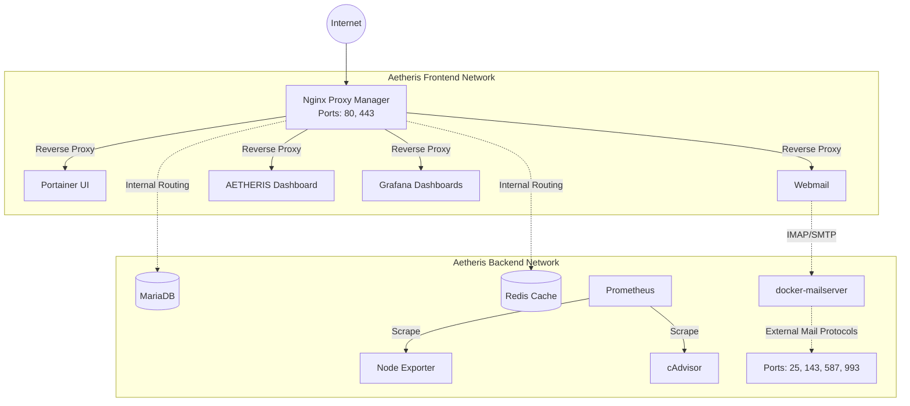

# AETHERIS

[](https://github.com/Cylae/AETHERIS)
[](https://www.docker.com/)

AETHERIS is an industrial-grade, environment-agnostic server stack orchestrator. Entirely rebuilt from the ground up, this version abandons legacy host-modification scripts in favor of a strictly declarative **Infrastructure as Code (IaC)** approach using Docker Compose.

It ensures true isolation, robust networking, comprehensive monitoring, and effortless reproducibility without polluting your host operating system.

---

## 🏗 High-Level Architecture

The core philosophy of AETHERIS is **Zero Host Pollution**. Every service runs in an isolated container.



### Key Architectural Decisions

1. **Unified Ingress (Nginx Proxy Manager):** Replaces conflicting host-level Nginx installations. All HTTP/HTTPS traffic is routed securely through isolated Docker bridge networks. SSL is automated via Let's Encrypt.
2. **Containerized Mail Server:** Replaces monolithic Mail-in-a-Box scripts. `docker-mailserver` operates purely via protocols (SMTP/IMAP) and delegates web access securely to a distinct `roundcube` container.
3. **Strict Volume Mapping:** All persistent state is centralized in `./data`, guaranteeing survival across host reboots and simplifying backups.
4. **Comprehensive Monitoring:** Embedded Prometheus, NodeExporter, cAdvisor, and Grafana provide real-time metrics and system health out-of-the-box.
5. **AETHERIS Dashboard:** A centralized, mathematically perfect, responsive React-based landing page for all exposed services, featuring a native-feeling Dark Mode.

---

## 🚀 One-Step Deployment Guide

**Prerequisites:**
- A Linux host (Ubuntu, Debian, AlmaLinux, etc.)
- Docker and Docker Compose (v2) installed.
- Ports 80, 443, 25, 143, 587, and 993 must be available on the host.

**Installation:**

Clone this repository and run the idempotent initialization script. It will scaffold directories, dynamically generate secure passwords, configure monitoring, and bring up the core infrastructure.

```bash
git clone https://github.com/Cylae/AETHERIS.git
cd AETHERIS

# Make the script executable
chmod +x install.sh

# Run the unified installer
./install.sh
```

**Post-Installation:**
1. Navigate to `http://<your-server-ip>:81`
2. Log into Nginx Proxy Manager with default credentials:
   - Email: `admin@example.com`
   - Password: `changeme`
3. Immediately change your credentials and begin routing your domain names to internal Docker containers (e.g., `aetheris_dashboard:80`, `aetheris_roundcube:80`, `aetheris_portainer:9000`).

---

## 📊 Monitoring Capabilities

AETHERIS includes a robust, pre-configured monitoring stack:

- **Prometheus:** Collects and stores metrics as time-series data.
- **Node Exporter:** Exposes hardware and OS metrics.
- **cAdvisor:** Analyzes resource usage and performance characteristics of running containers.
- **Grafana:** Visualizes metrics. Access it by routing a domain to `aetheris_grafana:3000` via Nginx Proxy Manager. The admin password is auto-generated in your `.env` file (`GRAFANA_ADMIN_PASSWORD`).

---

## ⚙️ Environment Variables Reference (`.env`)

The `install.sh` script automatically generates cryptographically secure secrets in your `.env` file. You may manually edit these to configure your domain and timezone.

| Variable | Description | Default |
| :--- | :--- | :--- |
| `TZ` | Container Timezone | `UTC` |
| `AETHERIS_DATA_DIR` | Host path for persistent databases and config | `./data` |
| `AETHERIS_MEDIA_DIR` | Host path for shared media files | `./media` |
| `PUID` / `PGID` | User/Group IDs to run containers as non-root | Auto-detected |
| `DOMAIN_NAME` | Primary domain for Mail and routing | `example.com` |
| `MAIL_HOSTNAME` | Full FQDN for the mail server | `mail.example.com` |
| `GRAFANA_ADMIN_PASSWORD` | Secure password for Grafana UI | Auto-generated |

---

## 🛡 Security Guidelines & Troubleshooting

AETHERIS is designed to be highly resilient and secure by default.

### 1. Isolated Networks
All internal database and caching traffic occurs strictly on the `aetheris_backend` network. Databases are *never* exposed directly to the host or internet.

### 2. Container Health Checks
Every container in the stack features a native Docker `healthcheck` definition. This ensures that dependent services (like Nextcloud or Gitea) only start after the database is confirmed healthy, preventing race conditions.

### 3. Checking Service Status
To view the live status of all orchestrator containers:

```bash
cd /path/to/AETHERIS
docker compose ps
```

### 4. Viewing Logs
Logs are centralized via Docker. To inspect Nginx Proxy Manager or Mailserver errors:

```bash
docker compose logs -f npm
docker compose logs -f mailserver
```

### 5. Automated Updates
AETHERIS includes **Watchtower**, configured to run daily at 04:00. It will automatically check for base image updates, pull them, and elegantly restart containers to ensure your stack remains patched against vulnerabilities.

---

*Project AETHERIS - The Environment-Agnostic Server Stack Orchestrator.*
