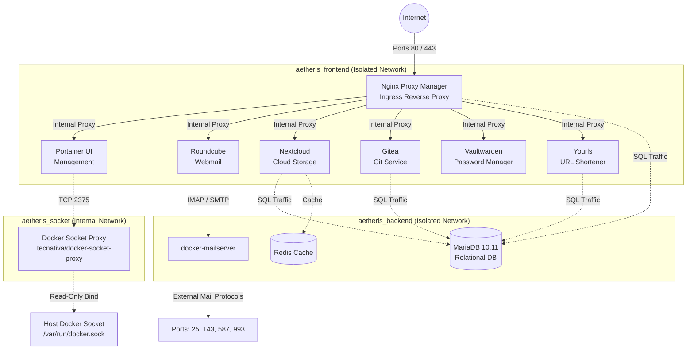

# AETHERIS

### The Pure Container-First Server Stack Orchestrator

[](#-high-level-architecture)
[](#-deployment)
[](LICENSE)

**AETHERIS** is an environment-agnostic server stack orchestrator built strictly with **Infrastructure as Code (IaC)** via Docker Compose. Rebuilt from the ground up, AETHERIS completely abandons legacy host-modifying scripts in favor of pure containerization, eliminating host OS pollution and ensuring reproducible, secure deployments across any Linux distribution.

---

## 🏗 High-Level Architecture

The core engineering principle of AETHERIS is **Zero Host Pollution**. Every application, database, cache, and reverse proxy operates within isolated Docker bridge networks with strict privilege boundaries.



### Key Architectural Decisions

1. **Unified Ingress (Nginx Proxy Manager):** Replaces bare-metal Web servers. All web traffic enters through NPM (ports `80`, `443`, and `81`), which handles automated SSL certificate provisioning via Let's Encrypt and routes requests to container internal networks.
2. **Containerized Mail Server (`docker-mailserver`):** Isolates SMTP/IMAP mail transport from host system packages. Web access is provided by a decoupled `roundcube` webmail container on `aetheris_frontend`.
3. **Hardened Docker Socket Access:** Portainer never binds directly to `/var/run/docker.sock`. Instead, Docker API access is proxied through `tecnativa/docker-socket-proxy` over a dedicated `aetheris_socket` network with constrained endpoint permissions.
4. **Principle of Least Privilege Database Isolation:** MariaDB database creation is managed via `/docker-entrypoint-initdb.d/init-dbs.sql`. Application users (`npm`, `nextcloud`, `gitea`, `yourls`) receive only explicit DDL/DML permissions (`SELECT, INSERT, UPDATE, DELETE, CREATE, DROP, ALTER, INDEX, REFERENCES`) rather than standard broad administrative grants.
5. **Centralized Data Persistence:** All application state and configurations are bind-mounted under `./data` and `./media` with restricted directory permissions (`750` for sensitive mail storage), ensuring simple backups and zero host contamination.

---

## 📦 Stack Services Matrix

| Service | Category | Image | Internal Port | Description |
| :--- | :--- | :--- | :--- | :--- |
| **Nginx Proxy Manager** | Ingress Proxy | `jc21/nginx-proxy-manager:latest` | `80`, `443`, `81` | Centralized web reverse proxy and SSL manager |
| **MariaDB** | Database | `mariadb:10.11` | `3306` | Multi-tenant relational SQL database engine |
| **Redis** | In-Memory Cache | `redis:alpine` | `6379` | High-performance cache for Nextcloud and session stores |
| **Docker Socket Proxy** | Security Proxy | `tecnativa/docker-socket-proxy:latest` | `2375` | Secure API gateway for Docker daemon access |
| **Portainer** | Management | `portainer/portainer-ce:latest` | `9000` | Web UI container management interface |
| **docker-mailserver** | Mail Transport | `mailserver/docker-mailserver:latest` | `25, 143, 587, 993` | Production containerized SMTP/IMAP mail server |
| **Roundcube** | Webmail | `roundcube/roundcubemail:latest` | `80` | Web client interface for mail management |
| **Nextcloud** | Cloud & Storage | `lscr.io/linuxserver/nextcloud:latest` | `80` | Self-hosted cloud storage and file collaboration |
| **Gitea** | DevOps & Git | `gitea/gitea:latest` | `3000`, `22` | Lightweight self-hosted Git service |
| **Vaultwarden** | Security | `vaultwarden/server:latest` | `80` | Lightweight Bitwarden-compatible password manager |
| **Yourls** | Web Utility | `yourls:latest` | `80` | Self-hosted URL shortener service |

---

## 🚀 One-Step Deployment Guide

### Prerequisites
- A Linux host system (Ubuntu 20.04+, Debian 11+, AlmaLinux 9+, RHEL 9+)
- Docker (v24.0+) and Docker Compose (v2.20+) installed
- OpenSSL utility installed (`openssl`)

### Step-by-Step Installation

1. **Clone the Repository:**
   ```bash
   git clone https://github.com/your-org/aetheris.git
   cd aetheris
   ```

2. **Execute Installation Script:**
   The `install.sh` script automatically scaffolds required directories with restrictive permissions (`750`), generates cryptographically secure passwords via OpenSSL into `.env`, constructs `init-dbs.sql`, and prepares the stack for launch.

   ```bash
   chmod +x install.sh
   ./install.sh
   ```

3. **Access Nginx Proxy Manager:**
   - Open your browser to `http://<YOUR_SERVER_IP>:81`
   - Default Administrator Credentials:
     - **Email:** `admin@example.com`
     - **Password:** `changeme`
   - **Immediate Requirement:** Change the admin email and password upon first login.

4. **Configure Proxy Host Routing:**
   In Nginx Proxy Manager, create Proxy Hosts mapping your domains/subdomains to internal container names:
   - Webmail: `aetheris_roundcube:80`
   - Container Management: `aetheris_portainer:9000`
   - Cloud Storage: `aetheris_nextcloud:80`
   - Git Server: `aetheris_gitea:3000`
   - Password Vault: `aetheris_vaultwarden:80`
   - URL Shortener: `aetheris_yourls:80`

---

## ⚙️ Environment Configuration (`.env`)

The `.env` file is initialized automatically from `.env.template` on first run.

| Variable | Description | Default / Format |
| :--- | :--- | :--- |
| `TZ` | Container Timezone | `UTC` |
| `AETHERIS_DATA_DIR` | Host directory for data persistence | `./data` |
| `AETHERIS_MEDIA_DIR` | Host directory for media storage | `./media` |
| `PUID` / `PGID` | User and Group ID for file permissions | Dynamic (`id -u` / `id -g`) |
| `DOMAIN_NAME` | Primary domain name for mail & services | `example.com` |
| `MAIL_HOSTNAME` | Fully Qualified Domain Name (FQDN) for mail | `mail.example.com` |
| `POSTMASTER_ADDRESS` | Postmaster contact address | `postmaster@example.com` |
| `MYSQL_ROOT_PASSWORD` | MariaDB root password | 48-char hex string |
| `NPM_DB_PASSWORD` | MariaDB password for Nginx Proxy Manager | 48-char hex string |
| `NEXTCLOUD_DB_PASSWORD` | MariaDB password for Nextcloud | 48-char hex string |
| `GITEA_DB_PASSWORD` | MariaDB password for Gitea | 48-char hex string |
| `YOURLS_DB_PASSWORD` | MariaDB password for Yourls | 48-char hex string |
| `REDIS_PASSWORD` | Redis authentication password | 48-char hex string |
| `ADMIN_TOKEN` | Vaultwarden admin token | 48-char base64 string |

---

## 🧪 Testing & Validation

AETHERIS includes an automated infrastructure test suite to verify deployment integrity, file permission security, SQL privilege restriction compliance, and Compose configuration correctness.

### Running Infrastructure Tests

```bash
# Run automated test suite
./tests/infrastructure_test.sh
```

**Test Verification Coverage:**
- Directory scaffolding presence (`./data/mailserver/*`, `./data/roundcube/*`, `./media`).
- Mail directory permission restrictions (`750`).
- Cryptographic secret generation and non-default password verification.
- SQL initialization script privilege enforcement (verifies absence of `ALL PRIVILEGES`).
- Structurally valid Docker Compose specification via `docker compose config`.

---

## 🛠 Operational Runbook & Maintenance

### 1. View Stack Status
```bash
docker compose ps
```

### 2. View Live Logs
```bash
# View logs for specific service
docker compose logs -f npm
docker compose logs -f mailserver
docker compose logs -f mariadb
```

### 3. Generate DKIM Keys for Mailserver
After deploying the stack, generate DKIM keys for your domain name:
```bash
docker exec -it aetheris_mailserver setup config dkim
```
Keys will be stored in `./data/mailserver/config/opendkim/keys/`.

### 4. Create Mail Accounts
```bash
docker exec -it aetheris_mailserver setup email add user@example.com <PASSWORD>
```

### 5. Graceful Restart & Container Updates
```bash
# Pull latest images and restart stack without data loss
docker compose pull
docker compose up -d --remove-orphans
```

---

## 🔒 Security Policy & Privilege Model

- **Database Least Privilege:** MariaDB database users are restricted to standard application execution privileges (`SELECT, INSERT, UPDATE, DELETE, CREATE, DROP, ALTER, INDEX, REFERENCES`).
- **Container Isolation:** No container runs with elevated host privileges except `mailserver` requiring `NET_ADMIN` for Fail2Ban capability.
- **Docker Socket Isolation:** Docker daemon API calls are restricted via `docker-socket-proxy`.
- **Restricted Directory Permissions:** Mail state and storage directories are provisioned with `750` permissions to prevent unauthorized host read access.

---

*Project AETHERIS - Pure Container-First Infrastructure Orchestration.*
