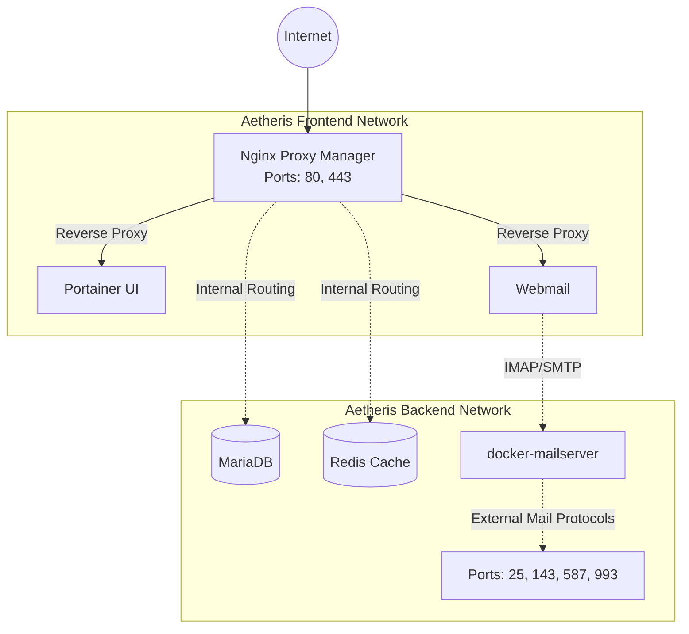

# AETHERIS

### The Pure Container-First Server Orchestrator

AETHERIS is an industrial-grade, environment-agnostic server stack orchestrator. Entirely rebuilt from the ground up, this version abandons legacy host-modification scripts in favor of a strictly declarative **Infrastructure as Code (IaC)** approach using Docker Compose.

It ensures true isolation, robust networking, and effortless reproducibility without polluting your host operating system.

---

## 🏗 High-Level Architecture

The core philosophy of the new AETHERIS is **Zero Host Pollution**. Every service runs in an isolated container.



### Key Architectural Decisions

1. **Unified Ingress (Nginx Proxy Manager):** Replaces conflicting host-level Nginx installations. All HTTP/HTTPS traffic is routed securely through isolated Docker bridge networks. SSL is automated via Let's Encrypt.
2. **Containerized Mail Server:** Replaces monolithic Mail-in-a-Box scripts. `docker-mailserver` operates purely via protocols (SMTP/IMAP) and delegates web access securely to a distinct `roundcube` container.
3. **Strict Volume Mapping:** All persistent state is centralized in `./data`, guaranteeing survival across host reboots and simplifying backups.

---

## 🚀 One-Step Deployment Guide

**Prerequisites:**
- A Linux host (Ubuntu, Debian, AlmaLinux, etc.)
- Docker and Docker Compose (v2) installed.

**Installation:**

Clone this repository and run the idempotent initialization script. It will scaffold directories, dynamically generate secure passwords, and bring up the core infrastructure.

```bash
git clone https://github.com/your-org/aetheris.git
cd aetheris

# Make the script executable
chmod +x install.sh

# Run the unified installer
./install.sh
```

**Post-Installation:**
1. Navigate to `http://<your-server-ip>:81`
2. Log into Nginx Proxy Manager with default credentials:
   - Email: `admin@example.com`
   - Password: `changeme`
3. Immediately change your credentials and begin routing your domain names to internal Docker containers (e.g., `aetheris_roundcube:80`, `aetheris_portainer:9000`).

---

## ⚙️ Environment Variables Reference (`.env`)

The `install.sh` script automatically generates cryptographically secure secrets in your `.env` file. You may manually edit these to configure your domain and timezone.

| Variable | Description | Default |
| :--- | :--- | :--- |
| `TZ` | Container Timezone | `UTC` |
| `AETHERIS_DATA_DIR` | Host path for persistent databases and configuration | `./data` |
| `AETHERIS_MEDIA_DIR` | Host path for shared media files | `./media` |
| `PUID` / `PGID` | User/Group IDs to run containers as non-root | Automatically detected |
| `DOMAIN_NAME` | Primary domain for Mail and routing | `example.com` |
| `MAIL_HOSTNAME` | Full FQDN for the mail server | `mail.example.com` |
| `ENABLE_CLAMAV` | Toggle Antivirus scanning in Mail (0 or 1) | `1` |
| `ENABLE_SPAMASSASSIN`| Toggle Anti-spam filtering (0 or 1) | `1` |

---

## 🛠 Maintenance & Troubleshooting Runbook

AETHERIS is designed to be highly resilient, but issues can arise. Follow these steps to diagnose and resolve common problems.

### 1. Checking Service Status

To view the live status of all orchestrator containers:

```bash
cd /path/to/aetheris
docker compose ps
```

### 2. Viewing Logs

Logs are centralized via Docker. To inspect Nginx Proxy Manager or Mailserver errors:

```bash
docker compose logs -f npm
docker compose logs -f mailserver
```

### 3. Port Conflicts

If Nginx Proxy Manager fails to start, ensure no host processes (like Apache or a bare-metal Nginx) are occupying ports `80` or `443`.

```bash
sudo lsof -i :80
sudo lsof -i :443
# Kill conflicting processes or disable the service (e.g., sudo systemctl disable apache2)
```

### 4. Updating Services

To pull the latest images and recreate the containers without losing data (volumes are preserved):

```bash
cd /path/to/aetheris
docker compose pull
docker compose up -d
```

### 5. Mailserver DKIM/SPF Generation

The containerized `docker-mailserver` requires manual generation of DKIM keys. After the stack is running, execute:

```bash
docker exec -ti aetheris_mailserver setup config dkim
```

Your keys will be generated in `./data/mailserver/config/opendkim/keys/`.

---

*Project AETHERIS - The Environment-Agnostic Server Stack Orchestrator.*
